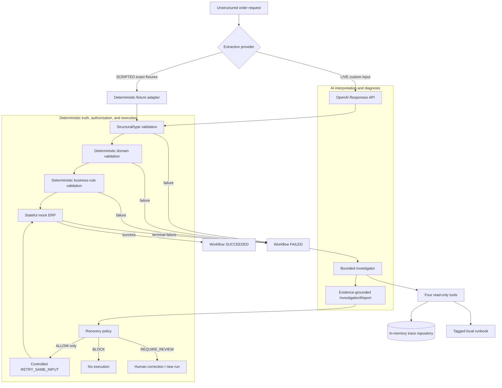

# TraceGuard

**Agentic Workflow Investigator & Safe Recovery System**

TraceGuard is a focused assessment project for investigating failures in an AI-assisted order workflow and safely deciding what, if anything, may happen next.

> **AI reasons and recommends. Deterministic code retains validation, authorization, and execution authority.**

Repository: [github.com/endihysenipx/traceguard](https://github.com/endihysenipx/traceguard). The project runs locally; there is no hosted deployment.

## Why this project exists

AI-powered workflows can fail during extraction, deterministic validation, or an external call. Giving an agent unrestricted remediation authority over its own diagnosis would be unsafe. TraceGuard demonstrates a smaller, inspectable design:

- LLM-based structured extraction;
- deterministic structural, domain, and business validation;
- append-only workflow traces and stage artifacts;
- one bounded, tool-using investigator;
- evidence-grounded structured recommendations;
- deterministic recovery policy; and
- one idempotent, policy-authorized retry.

This is an intentionally small assessment MVP, not a production operations platform.

## Architecture



The application is one FastAPI process with a thin static HTML/CSS/vanilla-JavaScript page. A repository abstraction owns process-local runs, events, artifacts, investigation history, policy decisions, and recovery executions.

Validation deliberately remains a sequence:

```text
provider output
-> structural/type validation
-> deterministic required-field/domain validation
-> deterministic business-rule validation
```

Provider parsing does not make business data complete or valid. The deterministic workflow owns canonical error codes and failure categories.

### Three orthogonal state machines

- **Workflow:** the original execution, ending in `SUCCEEDED` or `FAILED`.
- **Investigation:** `NOT_REQUIRED`, or `PENDING -> RUNNING -> COMPLETED/FAILED`.
- **Recovery:** `NONE`, `ALLOW`, `BLOCK`, `REQUIRE_REVIEW`, `RETRYING`, `RECOVERED`, or `RETRY_EXHAUSTED`.

After a successful retry, a run intentionally remains:

```text
Workflow: FAILED
Recovery: RECOVERED
```

The recovery record describes what happened later; it does not rewrite the original failure or its evidence.

## Why this is an agent, not just an LLM call

The investigator begins primarily with a `run_id`. It does not receive the canonical workflow error or full trace in its initial context. It chooses evidence to retrieve, uses the runbook, and synthesizes a strict report.

It has exactly four allowlisted, read-only tools:

1. `get_run_overview`
2. `get_run_events`
3. `get_stage_artifact`
4. `search_runbook`

Every run-specific tool is scoped to the current run. Tool results are bounded and treated as untrusted data. The loop is capped at **3 model turns** and **6 total tool calls**. Tool access does not grant recovery or mutation authority.

## Deterministic safety boundary

The workflow owns canonical truth. The investigator supplies agent-derived fields: diagnosed error, diagnosed category, and recommended enum action. The deterministic policy evaluates those alongside trusted workflow and repository facts:

- canonical workflow error;
- workflow and investigation state;
- validated-report status;
- ERP attempt count; and
- idempotency metadata.

It returns `ALLOW`, `BLOCK`, or `REQUIRE_REVIEW`, with deterministic reason codes and constraints.

An investigation may be evidence-grounded yet diagnose the wrong canonical error. TraceGuard still returns `BLOCK` with `DIAGNOSIS_CONFLICT`. Evidence grounding establishes that a report is trace-supported; it is not execution authorization.

## Controlled recovery and idempotency

The only automatically executable action is `RETRY_SAME_INPUT`, and only for an eligible canonical `ERP_UNAVAILABLE` failure.

- Maximum total ERP attempts: **2**.
- Policy-provided backoff: **1 second**.
- An atomic, repository-level `STARTED` claim precedes the side effect.
- A final policy/current-state guard runs after backoff, immediately before ERP submission.
- The retry reconstructs the stored `ValidatedOrder`; extraction and investigation are not rerun.
- Duplicate recovery calls return the recorded execution and cannot create attempt 3.

This in-memory claim demonstrates domain-level idempotency for the assessment. It is not distributed locking or durable crash reconciliation.

## SCRIPTED vs LIVE

| | SCRIPTED | LIVE |
|---|---|---|
| Purpose | Deterministic offline test/demo | Genuine OpenAI-backed path |
| Extraction input | Exactly four approved fixture texts | Arbitrary custom text |
| API key | Not required | `OPENAI_API_KEY` required |
| Parsing | Exact fixture lookup only; no heuristics | Structured extraction through the Responses API |
| Investigator | Deterministic and explicitly **not AI** | Genuine tool-using OpenAI investigator |
| Fallback | None | None |

SCRIPTED still exercises the real workflow, repository, validation, diagnostic tools, evidence validation, policy, and recovery layers. Editing fixture text in SCRIPTED extraction returns `LIVE_PROVIDER_REQUIRED`; the application neither resets the text nor silently changes provider.

## Four reproducible scenarios

| Preset | Expected result |
|---|---|
| `SUCCESS` | Workflow `SUCCEEDED`; investigation is not required. |
| `MISSING_CUSTOMER` | Workflow `FAILED` with `CUSTOMER_NUMBER_MISSING`; recommendation requests correction/review; policy `REQUIRE_REVIEW`; no execution. |
| `INVALID_QUANTITY` | Workflow `FAILED` with `QUANTITY_NON_POSITIVE`; policy `BLOCK`; no retry or silent correction. |
| `ERP_UNAVAILABLE` | Workflow `FAILED`; noisy non-causal events precede terminal ERP 503; investigation recommends `RETRY_SAME_INPUT`; policy `ALLOW`; attempt 2 succeeds; Recovery `RECOVERED` while Workflow remains historically `FAILED`. |

## Local setup

Python 3.11+ is recommended.

```powershell
python -m venv .venv
.venv\Scripts\Activate.ps1
python -m pip install -r requirements.txt
python -m pip install -r requirements-dev.txt
python -m uvicorn traceguard.api.app:app --reload
```

macOS/Linux:

```bash
python3 -m venv .venv
source .venv/bin/activate
python -m pip install -r requirements.txt
python -m pip install -r requirements-dev.txt
python -m uvicorn traceguard.api.app:app --reload
```

Open [http://127.0.0.1:8000](http://127.0.0.1:8000).

The repository intentionally has no Docker or deployment configuration.

## Environment variables

Copying `.env.example` is optional, but the application does **not** load `.env` automatically. Supply values through the shell, IDE, or process environment.

| Variable | Behavior |
|---|---|
| `OPENAI_API_KEY` | Required for LIVE extraction or investigation. Never commit it. |
| `TRACEGUARD_OPENAI_MODEL` | Extraction model; defaults to `gpt-5.4-nano`. |
| `TRACEGUARD_OPENAI_INVESTIGATOR_MODEL` | Investigator model; defaults independently to `gpt-5.4-mini`. |

The live adapters use the official OpenAI Python SDK and Responses API with strict structured output, bounded timeouts, and `store=False`. There is no silent fallback to SCRIPTED.

## Tests

```powershell
python -m pytest -q
```

Latest complete Phase 7 verification: **172 passed in 2.69s**.

The default suite is deterministic, API-key-free, and makes zero OpenAI network calls. Fake clients exercise provider requests, tool calls, refusals, timeouts, malformed output, sanitization, budgets, and policy conflicts.

## Credential-gated LIVE smoke checks

These commands are opt-in and excluded from the default suite:

```powershell
python -m traceguard.extraction.live_smoke
python -m traceguard.investigation.live_smoke
```

With no `OPENAI_API_KEY`, each prints a clear `SKIPPED` result and makes no external call. A skipped result is not proof that the LIVE path executed.

The investigator smoke prints its selected model, actual stored tool names/count, and either
`COMPLETED` or `SAFE_FAILURE: <reason>`. Safe failures exit non-zero without an automatic
retry and do not print an unhandled traceback.

Both LIVE paths have now been exercised against the real OpenAI API. LIVE extraction
succeeded. The first LIVE investigation exposed a `MODEL_TURN_LIMIT` integration defect
caused by disabled parallel function calls. After bounded parallel calls were enabled, one
real report was rejected as `REPORT_NOT_GROUNDED`, demonstrating deterministic fail-closed
evidence validation. A subsequent `gpt-5.4-mini` run completed successfully with four real
read-only tool calls in the intended 2 + 2 + structured-report flow.

These observations verify the integration path, not guaranteed completion of every model
invocation. Model output varies; refused, malformed, over-budget, or ungrounded results are
designed to fail closed.

## 2-4 minute scripted walkthrough

1. Start the application and select `ERP_UNAVAILABLE`.
2. Leave extraction and investigation set to `SCRIPTED`.
3. Run the workflow and inspect the outcome labels:
   - `OPTIONAL_FIELD_DEFAULTED` is `WARNING / CONTINUED`;
   - `CACHE_LOOKUP_FAILED` is `WARNING / RECOVERED`;
   - `CACHE_FALLBACK_SUCCEEDED` is `INFO / SUCCESS`;
   - `ERP_REQUEST_FAILED` is `ERROR / TERMINAL`.
4. Click **Investigate failure**. The real stored tool history shows:
   `get_run_overview -> get_run_events -> get_stage_artifact -> search_runbook`.
5. Inspect `TERMINAL_CAUSE` evidence and the cache warning marked `NON_CAUSAL_CONTEXT`.
6. Note that the deterministic scripted investigator (not AI) recommends `RETRY_SAME_INPUT`.
7. Click **Evaluate deterministic policy** and point out `ALLOW` and its constraints.
8. Click **Execute controlled retry**. Attempt 2 succeeds and Recovery becomes `RECOVERED`, while Workflow remains `FAILED`.
9. Optionally edit one character in the request and rerun with SCRIPTED extraction to see the clear LIVE-required boundary.

### Optional LIVE walkthrough

Set `OPENAI_API_KEY` in the process environment, select LIVE extraction for custom order text, and select LIVE investigation for a failed run. The UI will display genuine tool selection and stored tool-call history. This path depends on current credentials and API availability; it never falls back to SCRIPTED.

## Security and reliability controls

- Closed Pydantic request, tool-argument, artifact, report, policy, and execution schemas.
- Separate structural/type, domain-required-field, and business-rule validation.
- Canonical workflow errors owned only by deterministic workflow logic.
- Exactly four allowlisted read-only tools with current-run scoping.
- Untrusted-data instructions for order text, traces, artifacts, and runbook content.
- Bounded tool arguments/results and sanitized provider failures.
- Maximum 3 investigator turns and 6 tool calls.
- Evidence IDs must exist on the target run and have been retrieved through actual tool calls.
- At least one explicitly causal `TERMINAL` event is required; `CONTINUED` and `RECOVERED` events can only be non-causal context.
- Fail-closed deterministic recovery policy.
- Atomic idempotency claim, two-attempt cap, and post-backoff stale-authorization guard.
- No client-supplied canonical facts, policy decision, action, key, or retry count.

Prompt injection is not claimed to be solved. Its blast radius is constrained because the investigator has no write, HTTP, shell, policy, or retry tool.

## Deliberate MVP limitations

- In-memory persistence only; all state is lost on process restart.
- Single-process idempotency and locking, with no durable crash reconciliation.
- Tiny tagged local runbook and a small controlled failure taxonomy.
- One automatic recovery action only.
- SCRIPTED extraction is limited to exact fixtures.
- LIVE paths require credentials and model output remains variable. Both paths have been
  verified against the real API, including one safely rejected ungrounded investigation.
- No authentication, real ERP, distributed workers, queues, or production database.
- No hosted deployment.
- Visual browser QA was not completed in the coding-agent environment, although local HTTP page/API and scripted-flow verification succeeded.

These are deliberate assessment cuts that keep the safety boundary understandable and testable.

## With more time

Useful next steps would be a durable PostgreSQL repository, distributed idempotency/locking, a larger labelled investigation evaluation set, more ambiguous and adversarial traces, model comparisons, authentication, a real ERP connector, operational metrics/tracing, and deployment.

## How AI was used to build TraceGuard

A coding agent was used heavily for planning, implementation, test generation, refactoring, and debugging. Human review retained architectural and safety authority. Real review corrections included:

- missing product/quantity recovery semantics were initially inconsistent with missing customer semantics;
- the mock ERP initially emitted an optional-field warning from simulation mode instead of actual order facts;
- placing `ProviderMode` in the workflow package created an import cycle;
- globally strict tool-argument schemas initially rejected valid JSON UUID and enum strings;
- human review identified a stale-authorization window during recovery backoff and required a final guard immediately before ERP submission.
- a genuine LIVE investigation smoke exposed that disabling parallel tool calls was incompatible with the approved three-turn evidence-gathering strategy.

AI accelerated the build, but passing tests alone did not guarantee semantic consistency or safe side-effect timing.

## Planning and handoff history

The [planning](planning/) folder preserves the assessment trail:

- [requirements](planning/01-requirements.md)
- [scope](planning/02-scope.md)
- [architecture](planning/03-architecture.md)
- [implementation plan](planning/04-implementation-plan.md)
- [decisions and tradeoffs](planning/05-decisions-and-tradeoffs.md)
- [agent handoff](planning/06-agent-handoff.md)
- [live retrospective](planning/07-retrospective.md)
