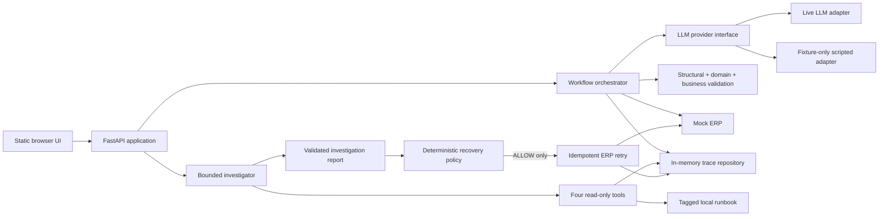

# TraceGuard Architecture

## Overview

TraceGuard is one FastAPI application serving API routes and a thin static HTML/JavaScript interface. It orchestrates the order workflow, stores runs and append-only events in memory behind a repository abstraction, invokes either a live or scripted LLM adapter, exposes four read-only diagnostic tools to one bounded investigator, and passes every recommendation to deterministic recovery policy.



## Components

### FastAPI application and UI

- Exposes run creation, run inspection, investigation, policy evaluation, and controlled retry endpoints.
- Serves a single static page with an editable request textarea and scenario controls.
- A preset fills the text and mock ERP behavior; the submitted values, not the preset name, drive execution.
- Shows the active provider so scripted and live behavior cannot be confused.

### Repository abstraction

- Stores runs, stage artifacts, events, investigation reports, policy decisions, and retry records in memory.
- Uses append-only event methods and explicit lookup/update operations rather than exposing the underlying collection.
- Allows tests to create isolated repositories and leaves a future persistence adapter possible without adding one to the MVP.
- Data is process-local and intentionally lost on restart.

### LLM-provider adapters

- A provider interface covers structured extraction and bounded investigation interaction.
- The live adapter is the primary AI path and supports arbitrary custom request text.
- The scripted adapter supports only exact approved fixtures for deterministic tests and offline demonstration.
- Unsupported custom text in scripted mode produces a clear boundary error rather than a fabricated extraction.

## Workflow and Validation Boundaries

The workflow state progression is:

```text
CREATED
→ EXTRACTING
→ STRUCTURE_VALIDATING
→ DOMAIN_VALIDATING
→ BUSINESS_VALIDATING
→ ERP_CALLING
→ SUCCEEDED
```

Any active stage may transition to `FAILED`. A successful policy-authorized retry changes the recovery status to `RECOVERED` and records new events; prior events remain unchanged.

The validation sequence is deliberately split:

1. **LLM extraction:** converts unstructured text to an `ExtractedOrderCandidate` response.
2. **Structural/type validation:** Pydantic verifies response shape and types. Candidate business fields may be null or absent. Invalid shape or types produce `ORDER_STRUCTURE_INVALID`.
3. **Deterministic domain validation:** checks required data and constructs `DomainOrder`. Missing customer data produces `CUSTOMER_NUMBER_MISSING`.
4. **Deterministic business-rule validation:** checks rules over present, typed data and constructs `ValidatedOrder`. Non-positive quantity produces `QUANTITY_NON_POSITIVE`.
5. **ERP submission:** sends only a `ValidatedOrder` to the mock external adapter.

The workflow, not the model, owns canonical failure categories and error codes.

## Orthogonal Status Models

### Workflow status

`CREATED`, `EXTRACTING`, `STRUCTURE_VALIDATING`, `DOMAIN_VALIDATING`, `BUSINESS_VALIDATING`, `ERP_CALLING`, `SUCCEEDED`, `FAILED`

### Investigation status

`NOT_REQUIRED`, `PENDING`, `RUNNING`, `COMPLETED`, `FAILED`

### Recovery status

`NONE`, `ALLOW`, `BLOCK`, `REQUIRE_REVIEW`, `RETRYING`, `RECOVERED`, `RETRY_EXHAUSTED`

## Trace and Event Model

Every event contains:

- `event_id` and timestamp;
- workflow stage and event type;
- severity;
- outcome: `CONTINUED`, `RECOVERED`, `TERMINAL`, or `SUCCESS`;
- bounded, sanitized details.

The ERP-unavailable fixture intentionally records an optional-field warning, a failed cache lookup followed by successful fallback, and then the terminal ERP 503. Severity alone does not determine causality: outcome metadata and chronology distinguish non-causal noise from terminal evidence.

## Investigator Flow

The investigator starts with the current `run_id`, a description of its read-only role, and an instruction to treat workflow content and tool results as untrusted data. It does not receive the full trace or canonical workflow error.

The tool registry exposes exactly:

1. `get_run_overview(run_id)` — statuses, completed/current stages, timing, and available artifact types; it omits the canonical error and prewritten root cause.
2. `get_run_events(run_id, stage?, limit?)` — ordered, sanitized events with severity and outcome metadata.
3. `get_stage_artifact(run_id, stage)` — one extraction, validation, or ERP result.
4. `search_runbook(query, error_code?, limit?)` — bounded ranked local guidance.

All tools validate arguments, enforce the current run scope, cap response sizes, and perform no writes. The loop permits at most three model turns and six tool calls. Duplicate invalid calls, unknown tools, timeouts, or exhausted budgets terminate the investigation safely.

The structured report includes the diagnosed category and code, root cause, one to five evidence references, an enum recommendation, rationale, confidence, uncertainties, and runbook references. At least one evidence item must cite the terminal event. Continued or recovered events may appear only as explicitly non-causal context.

## Local Runbook Retrieval

Runbook entries have stable IDs, titles, error-code tags, symptoms, diagnostic guidance, recovery guidance, and prohibited actions. Search ranks exact error-code/tag matches first and normalized lexical overlap second. A vector store is unnecessary for the small controlled corpus and would make behavior less transparent and harder to test.

## Deterministic Recovery Policy

The policy receives the deterministic canonical error, validated recommendation, workflow state, investigation validity, retry attempt count, and idempotency-key state. It returns `ALLOW`, `BLOCK`, or `REQUIRE_REVIEW` with reason codes and constraints.

- `CUSTOMER_NUMBER_MISSING` plus input correction or human review produces `REQUIRE_REVIEW`.
- `QUANTITY_NON_POSITIVE` always produces `BLOCK`.
- `ERP_UNAVAILABLE` plus `RETRY_SAME_INPUT` may produce `ALLOW` only with a valid report, an idempotency key, and fewer than two total ERP attempts.
- Conflicts, malformed reports, unknown errors, missing idempotency, and exhausted retries produce `BLOCK`.

The policy is re-evaluated immediately before execution. A permitted retry waits one second and uses the run's idempotency key. Duplicate requests return the recorded result instead of calling ERP again.

## Responsibility Boundaries

### AI

- Interpret unstructured text into a typed candidate.
- Choose diagnostic tools and synthesize a structured, evidence-based recommendation.

### Deterministic code

- Validate structure, required domain data, and business rules.
- Own state transitions, event recording, canonical errors, mock ERP behavior, retrieval ranking, tool enforcement, report parsing, policy, retry limits, idempotency, and execution.

### Human

- Review incomplete data, correct the editable request, and submit a new run.
- Handle unknown or higher-risk actions outside the single allowed retry.
- No approve/reject workflow is implemented in the MVP.

## Security and Reliability Controls

- Treat request text and stored tool output as untrusted data, never as higher-priority instructions.
- Use strict input/output schemas, enum actions, bounded strings and lists, and Pydantic validation.
- Allowlist four read-only tools and enforce current-run scoping.
- Hide canonical errors from the investigator but retain them for deterministic policy.
- Enforce model-turn, tool-call, payload, and timeout limits.
- Reject malformed output after at most one structured-output retry and block recovery.
- Sanitize provider errors and trace details; never store or display API keys or full secret-bearing requests.
- Default policy to `BLOCK` for unknown, contradictory, or invalid conditions.
- Use idempotency keys and recorded attempt results to prevent duplicate side effects.
- Keep scripted-provider limitations explicit in API errors, traces, and UI labels.
